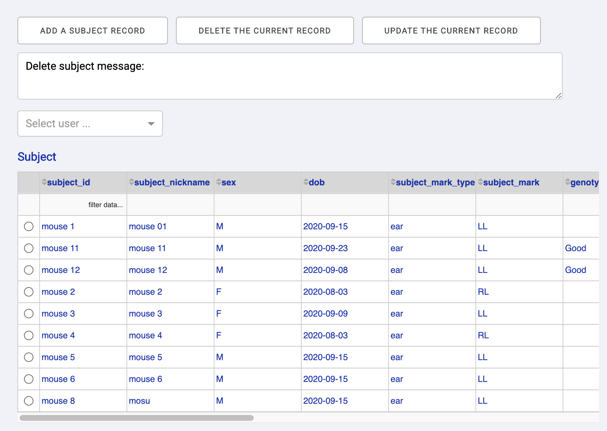

# dj-dashboard
Developing toolbox to build a Plotly Dash app for a DataJoint pipeline

A simple example to build a page for DataJoint table subject.Subject:

```
import dash
import dash_bootstrap_components as dbc
from pipeline import lab, subject      # import all modules that the target tables may depend on
from dj_dashboard.templates import TableBlock

app = dash.Dash(__name__,
                external_stylesheets=[dbc.themes.BOOTSTRAP],
                suppress_callback_exceptions=True)

app.layout = TableBlock(subject.Subject, app)

if name == '__main__':
    app.run_server(port='8050')
```

Run the script, open your broswer and visit http://localhost:8050, You will get a page like this:

